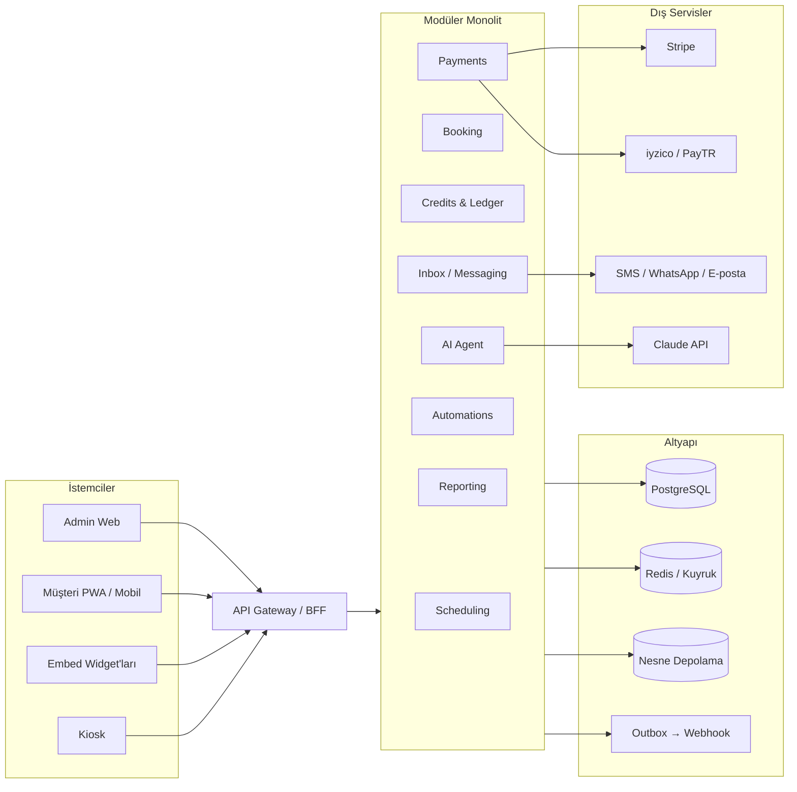
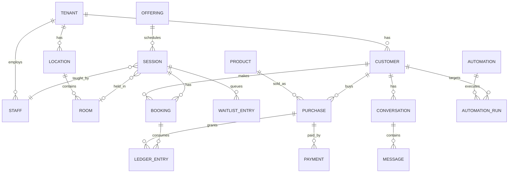

# Studio OS — Momence Analizi, Klon + Geliştirme Planı

> **Çalışma adı:** Studio OS (nihai marka adı Momence'ten net biçimde ayrışmalı — bkz. Bölüm 13)
> **Hazırlanma tarihi:** 3 Ekim 2026
> **İncelenen kaynaklar:** momence.com (ana sayfa, Features, AI Inbox, Marketing, Pricing) + üçüncü taraf kullanıcı yorumları, karşılaştırma yazıları, ödeme altyapısı notları
> **Durum:** Taslak v1 — karar bekleyen noktalar Bölüm 14'te

---

## İçindekiler

0. [Yönetici Özeti](#0-yönetici-özeti)
1. [Momence Analizi](#1-momence-analizi)
2. [Zayıf Yönler → Fırsatlar](#2-zayıf-yönler--fırsatlar)
3. [Rakip Görünümü](#3-rakip-görünümü)
4. [Ürün Stratejisi ve İlkeler](#4-ürün-stratejisi-ve-ilkeler)
5. [Kapsam: Parity + Farklılaşma](#5-kapsam-parity--farklılaşma)
6. [Teknik Mimari](#6-teknik-mimari)
7. [Yol Haritası](#7-yol-haritası)
8. [Ekip, Süreç ve Tahmini Efor](#8-ekip-süreç-ve-tahmini-efor)
9. [Kalite ve Test Stratejisi](#9-kalite-ve-test-stratejisi)
10. [Fiyatlandırma ve Pazara Çıkış](#10-fiyatlandırma-ve-pazara-çıkış)
11. [Başarı Metrikleri](#11-başarı-metrikleri)
12. [Riskler ve Azaltma](#12-riskler-ve-azaltma)
13. [Hukuki ve Uyum Notları](#13-hukuki-ve-uyum-notları)
14. [Açık Sorular / Karar Bekleyenler](#14-açık-sorular--karar-bekleyenler)
15. [İlk 14 Gün Aksiyon Listesi](#15-ilk-14-gün-aksiyon-listesi)
- [Ek A — Parity Kontrol Listesi](#ek-a--parity-kontrol-listesi)
- [Ek B — MVP Epic ve Kabul Kriterleri](#ek-b--mvp-epic-ve-kabul-kriterleri)
- [Ek C — Kaynaklar ve Güvenilirlik Notları](#ek-c--kaynaklar-ve-güvenilirlik-notları)

---

## 0. Yönetici Özeti

**Momence nedir?** Fitness ve wellness stüdyoları (yoga, pilates, dans, indoor cycling, gym, butik stüdyolar) için bulut tabanlı bir yönetim platformu. Takvim, rezervasyon, üyelik/paket satışı, ödeme, müşteri iletişimi (inbox), pazarlama otomasyonu, lead yönetimi, raporlama, mobil uygulama ve AI destekli mesaj asistanını tek müşteri kaydı üzerinde birleştiriyor. Site alt bilgisine göre Xplor çatısı altında.

**Neden iyi çalışıyor?**
- "Tek platform, tek veri" yaklaşımı: pazarlama otomasyonları gerçek davranışa (ilk ziyaret, devamsızlık, terk edilen sepet) göre tetikleniyor.
- Çok geniş kapsam: sınıf + randevu + workshop + retreat + mekân kiralama + on-demand video + LMS aynı takvimde/kasada.
- Dikey modüller: dans resitali/kostüm, SOAP notları, WOD programlama, kiosk/kapı erişimi.

**Nerede zayıf?** (Detay Bölüm 2)
1. **Şeffaflık:** Resmi fiyat sayfası artık tablo yerine "bizimle konuşun" yaklaşımına geçmiş; üçüncü taraflar ücretlerin katmanlı (abonelik + platform komisyonu + işlem ücreti + eklentiler) olduğunu raporluyor.
2. **Güvenilirlik ve destek:** Ödeme, veri taşıma, faturalama ve hesap erişimi çevresinde tekrar eden şikayetler; mühendislik kaynaklı sorunlarda uzun bekleme süreleri.
3. **Açıklık:** API'de takvim yazma yok, webhook yok (üçüncü taraf analizi); website embed'inde kısıtlar.
4. **Kullanım pürüzleri:** Çok günlü tekrar eden sınıf kurulumu, sezon/dönem modeli, raporların sınırlılığı.
5. **Ticari model:** İkinci kullanıcıda fiyat sıçraması, ücretli markalı uygulama ve AI eklentileri.

**Strateji (tek cümle):** *"Momence'in işlevsel kapsamını yakala, sonra güvenilirlik + şeffaf fiyat + açık API + AI copilot + yerel ödeme/iletişim kanallarıyla ayrış."*

**Önerilen yaklaşım:** 4 aşamalı ilerleme

| Aşama | İçerik | Süre (tahmini*) |
|---|---|---|
| **A. Çekirdek (MVP/Beta)** | Takvim, rezervasyon, üyelik/paket, ödeme, hosted booking sayfası + embed, temel rapor | ~15 hafta (Faz 0–1) |
| **B. Parity + Gelir motoru** | Inbox, sequences, lead, kiosk, API/webhook, indirim/hediye kartı, ödeme planları | ~10 hafta (Faz 2) |
| **C. Farklılaşma** | Mobil/PWA, AI Inbox + AI Copilot, Spotfiller+, MCP, akıllı taşıma | ~10 hafta (Faz 3) |
| **D. Dikey paketler ve ölçek** | LMS/on-demand, retail, SOAP, resital, WOD, enterprise | Sürekli (Faz 4–5) |

\* 5–6 kişilik çekirdek ekip varsayımıyla; ayrıntı ve varsayımlar Bölüm 8'de.

**Dürüst not:** Momence yıllardır geliştirilen, geniş kapsamlı bir ürün. "Birebir klon" gerçekçi bir hedef değil; hedef **"temel iş akışlarında eşdeğer + 8–10 alanda belirgin üstün"** olmalı.

---

## 1. Momence Analizi

### 1.1 Konumlandırma ve değer önerisi

- **Slogan mantığı:** "Stüdyonu kendi yolunla kur" — esneklik vurgusu. Rezervasyon, ödeme ve pazarlamayı tek platformda toplayarak yazılımın işletmeyi sınırlamamasını vaat ediyor.
- **Altı değer sütunu (ana sayfa):**
  1. Takvim kur (sınıf, randevu, workshop, etkinlik, retreat, mekân, on-demand)
  2. Kendi yöntemine göre sat (üyelik, paket, intro offer, drop-in, abonelik)
  3. Konuşmaları birbirine bağla (tek inbox + müşteri bağlamı)
  4. Müşteri tabanını büyüt (lead yakalama, otomasyon, davranış bazlı kampanya)
  5. İşini anla (katılım, müşteri, üyelik, pazarlama, gelir raporları)
  6. Ödeme al (online/yerinde ödeme, faturalama, gelirin operasyonla bağlantısı)
- **Satış modeli:** Hem "ücretsiz deneme / kayıt" hem demo odaklı satış. Sosyal kanıt: çok sayıda stüdyo logosu ve vaka çalışması.
- **Dikey sayfalar:** Yoga, Pilates, Dans, Indoor Cycling, Fitness & Gym, Boutique.

### 1.2 Özellik envanteri

> **Öncelik:** P0 = MVP şart · P1 = Parity için ilk büyük dalga · P2 = Parity tamamlama / farklılaşma · P3 = Dikey/ileri aşama
> **Karmaşıklık:** S (≤1 hf) · M (2–3 hf) · L (4–6 hf) · XL (6+ hf)

| # | Modül | Ne yapıyor (Momence'in tanımına göre) | Öncelik | Karmaşıklık |
|---|---|---|---|---|
| 1 | **Sınıf ve randevu zamanlama** | Sınıf, randevu, workshop, etkinlik, retreat, mekân; kapasite, kural, fiyat, personel ataması; tek esnek takvim | P0 | XL |
| 2 | **Üyelikler** | Sınırsız, kullanım limitli, ücretsiz deneme; upgrade/downgrade/transfer | P0 | L |
| 3 | **Ödemeler ve ödeme planları** | Online + yerinde kart, doğrudan borçlandırma (direct debit), kayıtlı ödeme yöntemi, taksitli/dönemli tahsilat | P0 | XL |
| 4 | **Website eklentileri (embed)** + otomatik işletme sayfaları | Takvim, randevu formu, lead formu, intake formu, yorum widget'ı; sitesi olmayanlar için hazır sayfa | P0 | L |
| 5 | **Personel yönetimi ve roller** | Çoklu rol/erişim seviyesi, otomatik hoca ikamesi, mesai giriş-çıkış | P0 (roller) / P1 (ikame, clock-in) | M–L |
| 6 | **Raporlama** | KPI panoları, nakit esaslı ve tahakkuk esaslı satış, bordro raporu, intro offer dönüşümü | P0 (temel) / P1 (ileri) | L |
| 7 | **Arrivals / check-in** | Anahtar, barkod, fob ile giriş takibi; kapı erişim sağlayıcı entegrasyonu | P1 (check-in) / P3 (kapı erişimi) | M / L |
| 8 | **Inbox** | Çift yönlü SMS, uygulama içi mesaj, e-posta, Instagram/Facebook DM — tek yerde | P1 (e-posta+SMS) / P3 (IG/FB) | XL |
| 9 | **Sequences** | Davranışa dayalı otomatik yolculuklar: karşılama, intro dönüşümü, devamsızlık, win-back | P1 | L |
| 10 | **Newsletter ve outreach** | Segmentasyon, çoklu liste, açılma/tıklama takibi | P1 | L |
| 11 | **Lead toplama ve yönetimi** | Facebook lead ads, web, yüz yüze; aşama ve pipeline takibi | P1 | M–L |
| 12 | **Intake formları** | Randevu/hizmete bağlı formlar, yanıt takibi, otomasyon tetikleme | P1 | M |
| 13 | **Hediye kartı ve indirim kodları** | Fiziksel/dijital, kapsam kısıtı, müşterinin kendi hediye kartını planlaması | P1 | M |
| 14 | **Akıllı bildirimler** | Personel/işletme için olay bazlı bildirim | P1 | S–M |
| 15 | **Spotfiller** | Boş kontenjanı doldurmak için kurallara bağlı otomatik iletişim | P2 | M |
| 16 | **AI Inbox Agent** | Sık soruları yanıtlar; rezervasyon, bekleme listesi, üyelik güncelleme gibi uygun işlemleri yapar; gerekirse insana devreder; ton/isim/uzunluk ayarı; yayına almadan önce bilgi eksikliği kontrolü | P2 | XL |
| 17 | **Spot (yer) seçimi** | Reformer/bisiklet/yer seçimi, stüdyo yerleşim editörü | P2 | L |
| 18 | **Yorumlar** | Ders sonrası yorum isteği, 5 yıldızlıları Google yorumuna yönlendirme, web widget'ı | P2 | M |
| 19 | **Topluluk (post/grup/challenge)** | Gruplar, medya paylaşımı, beğeni/yorum, challenge | P2 | L |
| 20 | **Kiosk / self check-in** | Müşterinin kendi kendine giriş yapması | P2 | M |
| 21 | **Mobil uygulama** | Ücretsiz paylaşımlı uygulama (müşteri yalnızca kendi stüdyosunu görür, başka işletme keşfedemez) + markalı uygulama seçeneği | P1 (PWA) / P2 (native) | L–XL |
| 22 | **Hazır entegrasyonlar** | Tamamlayıcı yazılım ortaklarıyla entegrasyon | P1 | M |
| 23 | **On-demand video + LMS kursları** | Üyeliğe bağlı veya tekil satış; hoca eğitimi kursları | P3 | XL |
| 24 | **Retail ve envanter** | Ürün satışı, stok takibi | P3 | L |
| 25 | **SOAP notları** | Şablon, çoğaltma, kilitleme, ileri yetki | P3 | L |
| 26 | **Resital ve kostüm yönetimi** | Çakışma kontrolü, veli görünümü, kostüm siparişi | P3 | L |
| 27 | **Workout / WOTD programlama** | Antrenman şablonu, skorlama, PR takibi | P3 | L |

### 1.3 Fiyatlandırma ve gelir modeli

> ⚠️ **Teyit gerekir.** Resmi fiyat sayfası (3 Ekim 2026 itibarıyla) tablo göstermiyor; işletmeye göre teklif sunduğunu söylüyor. Aşağıdaki rakamlar **üçüncü taraf** yazılardan derlendi; bir kısmı rakip firmaların blogları (taraflı olabilir) ve tarihleri 3–7 ay önceye uzanıyor.

| Başlık | Üçüncü taraflarca aktarılan bilgi |
|---|---|
| Kademeler | Basic (ücretsiz) · Pro (~$60/ay) · Custom (~$199/ay) |
| Platform komisyonu | Basic'te işletmeden ~%5 + müşteriden ~%4; Pro'da ~%2,5; Custom'da yok |
| Kart işleme (ABD) | Online ~%3,9 + $0,30 (platform komisyonuna ek olarak) |
| Kullanıcı sıçraması | İkinci kullanıcı/personelde Pro'dan ~$199'a geçiş (rakip blog iddiası) |
| Eklentiler | AI Agent eklentisi (~$399/ay, 3. taraf), markalı uygulama (~$200+/ay, eski kaynak), web sitesi barındırma (~$199/ay, rakip blog) |
| Kullanıcı şikayeti | Stripe'ın üzerine ek %1 yüzey ücreti iddiaları, uzun taahhüt ve iptal sürtünmesi |

**Çıkarım:** Momence "ücretsiz ya da düşük abonelik + işlem başına gelir" modeliyle büyüyor. Bu, büyüyen stüdyolar için maliyeti öngörülemez kılıyor — **bizim en net fiyat farklılaşma alanımız.**

### 1.4 Korunması gereken güçlü yönler

| Güçlü yön | Neden önemli | Planımızdaki karşılığı |
|---|---|---|
| Tek müşteri kaydı (rezervasyon + satın alma + mesaj + pazarlama) | Bağlamlı destek ve davranış bazlı otomasyonun temeli | Veri modelinin merkezi: `Customer 360` |
| Davranış tetikli otomasyon | Gerçek büyüme motoru | Event-driven otomasyon motoru (Bölüm 6) |
| Çok formatlı takvim | Stüdyoların tek araçta çalışması | Offering/Session soyutlaması |
| Kurulum/transfer ücreti olmaması ve düşük giriş eşiği (kullanıcı yorumları) | Benimsemeyi kolaylaştırıyor | Ücretsiz başlangıç + ücretsiz taşıma |
| 7/24 sohbet desteğini öven yorumlar | Destek algısı pozitif olabiliyor | Destek kalitesini ürün özelliği yapmak (D14) |
| Dikey zenginlik | Niş stüdyoları çekiyor | Çekirdek + dikey paket mimarisi |

---

## 2. Zayıf Yönler → Fırsatlar

> **Kanıt gücü:** ●●● çok sayıda bağımsız kaynakta tekrar ediyor · ●●○ birkaç kaynak · ●○○ tek/eski/taraflı kaynak. Yorumlar tek tek alıntılanmadı; temalar özetlendi. Kaynak listesi Ek C'de.

| # | Zayıf yön (kullanıcı geri bildirimi) | Kanıt | Bizim çözümümüz | Faz |
|---|---|---|---|---|
| 1 | **Opak ve katmanlı fiyat:** gerçek maliyet satış görüşmesiyle ortaya çıkıyor; abonelik + komisyon + işlem ücreti + eklenti birikiyor | ●●● | Herkese açık fiyat + etkileşimli maliyet hesaplayıcı; platform komisyonu yok (veya açıkça görünür); satın alma öncesi "faturanız şu olur" simülasyonu | 1 |
| 2 | **Destek yetersizliği:** yavaş geri dönüş, mühendisliğe aktarılan sorunlarda haftalarca bekleme, şablon cevaplar | ●●● | Yayınlanmış SLA, önceliklendirme (ödeme/rezervasyon = P1 olay), AI ilk yanıt + insan, herkese açık status sayfası | 1–3 |
| 3 | **Faturalama/iptal sürtünmesi ve sözleşme şikayetleri** | ●●● | Panelden self-servis iptal/duraklatma/dışa aktarma; aylık, taahhütsüz plan; fatura portalı | 1 |
| 4 | **Güvenilirlik:** ödeme, veri taşıma, faturalama, hesap erişimi çevresinde hata/uyumsuzluk; ücret ayarlarının yanlış yapılandırıldığına dair ciddi iddialar | ●●● | Çift girişli ledger, idempotent ödeme akışı, günlük mutabakat (reconciliation) işi, yapılandırma değişikliği öncesi **etki önizlemesi**, audit log | 1–2 |
| 5 | **Onboarding ve satış vaadi uyumsuzluğu:** "çalışır" denilen şeyin canlıda çalışmaması | ●●○ | Rehberli kurulum sihirbazı, örnek verili sandbox, **"yapamadıklarımız" sayfası** (dürüst özellik matrisi), canlıya çıkış kontrol listesi | 1 |
| 6 | **Zamanlama pürüzleri:** aynı sınıfı birden fazla güne tek seferde kuramama; sezon/dönem/oturum yaklaşımına yetersiz esneklik; sınıf kurulumunun uzun sürmesi | ●●○ | RRULE tabanlı çok günlü tekrar, **Dönem/Sezon (Term)** modeli, toplu düzenleme + önizleme, şablonlar | 1 |
| 7 | **Embed kısıtları:** sayfa başına tek tür sınıf/etkinlik (eski yorum; güncel durum teyit edilmeli) | ●○○ | Çoklu tür/filtreli widget, Web Components, tema değişkenleri, headless API | 1–2 |
| 8 | **Raporlar sınırlı ve bazen tutarsız** | ●●○ | Rapor oluşturucu, rakamların ledger ile mutabakatı, doğal dil sorgusu | 2–3 |
| 9 | **API:** takvim salt okunur, webhook yok, sınırlı Zapier tetikleyicisi (3. taraf analizi) | ●●○ | Tam CRUD API, imzalı webhook'lar, OpenAPI + SDK, Zapier/Make/n8n, **MCP sunucusu** | 2–3 |
| 10 | **Müşteri tarafı:** uygulamadan destek ulaşılamıyor, web↔uygulama oturumu ayrı, eski stüdyoyu listeden kaldıramama | ●●○ | Tek hesap (web+app), uygulama içi yardım/sohbet, stüdyo listesi yönetimi, müşteri yardım merkezi | 3 |
| 11 | **Uygulama yalnızca rezervasyon aracı; başka işletmeler keşfedilemiyor** | ●●○ (resmi sayfa) | Opsiyonel, opt-in keşif katmanı (stüdyo izin verirse) | 4 |
| 12 | **Markalı uygulama ve AI ücretli eklenti** | ●●○ | White-label PWA tüm planlarda dahil; AI için şeffaf kredi paketi | 2–3 |
| 13 | **Agresif dışarıdan satış arama/e-posta şikayetleri** | ●○○ | Ürün odaklı büyüme (PLG), self-servis kayıt, soğuk arama yok | GTM |
| 14 | **Personel sayısına bağlı fiyat sıçraması** | ●●○ (rakip kaynaklı) | Koltuk bağımsız fiyatlandırma | GTM |
| 15 | **Ürün "yarım kalmış" hissi, hatalar** | ●●○ | Kalite kapıları, feature flag, canary yayın, e2e test zorunluluğu | Sürekli |
| 16 | **Küçük UX eksikleri:** liste sayfalamada konumu kaybetme, başkası için ders satın alma yok, kart okuyucuda ücret yansıtma | ●○○ | Durumu koruyan listeler, "başkasına hediye et", POS'ta ek ücret yansıtma | 2 |

---

## 3. Rakip Görünümü

> Fiyatlar üçüncü taraf kaynaklardan ve **kaynaklar arasında tutarsız**; yalnızca büyüklük sırası için kullanın. Birçok kaynak bir rakibin blogu olduğundan taraflı olabilir.

| Rakip | Konum | Dikkat çeken yön | Bizim için ders |
|---|---|---|---|
| **Mindbody** | Pazar lideri, geniş tüketici keşif uygulaması | Plan fiyatı personel eklenince değişmiyor; sözleşmeli, fiyatlar kademeli | Keşif/marketplace gücü büyük bir hendek; kurumsal olgunluk |
| **Mariana Tek** | Premium butik fitness | Spot seçimi çekirdek özellik, markalı uygulama dahil, güzel arayüz | "Güzel UX + marka" için ödemeye hazır segment var |
| **Glofox** | Fitness/gym | Markalı uygulama ek ücretli, kullanıcı memnuniyeti karışık | Gym segmentinde üyelik ve erişim kontrolü kritik |
| **WellnessLiving** | Çok dikeyli | İkinci personelde fiyat sıçraması iddiası | Koltuk bazlı sıçrama ortak şikayet |
| **Vagaro** | Salon/spa + fitness | Çok düşük giriş fiyatı, personel başı ücret | Düşük fiyat eşiği pazarı genişletiyor |
| **Walla, Arketa, PushPress, Junocal, Pembee vb.** | Yeni nesil niş oyuncular | Düz fiyat, düşük/şeffaf komisyon, hızlı kurulum | Şeffaf fiyat tek başına bir farklılaşma ama **yeterli değil** — AI + açıklık + güvenilirlikle birleşmeli |

**Boşluk analizi (hendek adayı alanlar):**
1. Şeffaf fiyat **+** kapsamlı özellik seti bir arada (niş rakipler ya sade ya şeffaf; büyükler kapsamlı ama opak).
2. Açık platform (webhook, yazılabilir takvim, MCP) — büyük rakiplerde de sınırlı olabilir.
3. AI'ın "mesaj cevaplayıcı" olmaktan çıkıp **operasyon copilot'u** olması.
4. Yerel ödeme ve iletişim kanalları (WhatsApp, yerel PSP'ler, taksit) — global oyuncuların zayıf olduğu alan.

---

## 4. Ürün Stratejisi ve İlkeler

**Konumlandırma cümlesi (taslak):**
> Stüdyolar için; sürpriz ücret ve kırılgan entegrasyon olmadan çalışan, açık ve AI-native bir işletim sistemi.

### 4.1 Yedi ürün ilkesi

| # | İlke | Somut anlamı |
|---|---|---|
| 1 | **Şeffaflık varsayılandır** | Herkese açık fiyat, ücret hesaplayıcı, sözleşmede gizli madde yok, iptal 3 tıkta |
| 2 | **Güvenilirlik, özellikten önce gelir** | Ödeme ve rezervasyon akışlarında hata bütçesi yok denecek kadar düşük; yeni özellik "sağlamlık kapısını" geçmeden yayına çıkmaz |
| 3 | **API-first, webhook-first** | UI'ın yapabildiği her şeyi API de yapar; her olay webhook'tur |
| 4 | **AI eylem yapar ama denetlenir** | Her AI eylemi izlenebilir, sınırlandırılabilir, geri alınabilir |
| 5 | **15 dakikada ilk rezervasyon** | Onboarding'in ölçülen hedefi (time-to-first-booking) |
| 6 | **Taşınabilirlik** | Girişi de çıkışı da kolay: tek tıkla tam veri dışa aktarma (güveni artırır) |
| 7 | **Çekirdek + dikey paketler** | Dans, SOAP, WOD gibi özellikler çekirdeği şişirmeden eklenti olarak gelir |

### 4.2 Hedef kullanıcı (persona) hipotezleri

| Persona | İhtiyaç | Ağrı | Öncelikli değer |
|---|---|---|---|
| **Stüdyo sahibi-hoca (1–3 kişi)** | Hızlı kurulum, düşük maliyet | Zaman yok, bütçe sınırlı | Ücretsiz başlangıç, AI kurulum sihirbazı |
| **Büyüyen butik stüdyo (5–20 personel)** | Otomasyon, raporlama, markalı deneyim | Araç parçalanması, öngörülemez maliyet | Şeffaf fiyat, sequences, analitik |
| **Çok lokasyonlu zincir/franchise** | Yetki, standardizasyon, konsolide rapor | Veri silosu, uyum | Çoklu lokasyon, SSO, API |
| **Stüdyo müşterisi (son kullanıcı)** | Kolay rezervasyon, esnek üyelik | Uygulama/giriş karmaşası, destek yok | PWA/uygulama, self-servis portal |
| **Entegratör/ajans** | Stüdyo web sitesi ve otomasyon kurmak | Kısıtlı API | Açık API, webhook, SDK |

---

## 5. Kapsam: Parity + Farklılaşma

### 5.1 Parity (eşdeğerlik) kapsamı

Bölüm 1.2'deki 27 modülün tamamı parity hedefidir; sıralama P0→P3 öncelik sütununa göredir. Ayrıntılı alt özellik kontrol listesi **Ek A**'dadır.

**Parity'de "aynısını yapma" yerine "daha iyi yapma" kuralları:**
- Takvimde aynı kavramı yeniden üretirken Bölüm 2'deki #6 şikayetini (çok günlü tekrar, dönem modeli) baştan çöz.
- Embed'i ilk günden çoklu tür/filtre destekli tasarla (#7).
- API'yi arayüzden sonra değil, **aynı anda** geliştir (#9).

### 5.2 Farklılaşma özellikleri (D1–D14)

#### D1 — Şeffaf Ödeme ve Ücret Motoru ⭐
| Alt özellik | Açıklama |
|---|---|
| Sağlayıcıdan bağımsız ödeme katmanı | `PaymentProvider` arayüzü; Stripe, iyzico, PayTR, ileride Adyen/Mollie vb. adaptörler |
| Ücret hesaplayıcı + canlı önizleme | Sahibin "müşteri ücreti üstlensin" ayarını açtığında gerçek etkiyi örnek işlemle gösterir |
| Mutabakat (reconciliation) | Günlük otomatik: sağlayıcı payout'u ↔ ledger; fark varsa uyarı |
| Ücret yansıtma (surcharge) | Online ve POS/kart okuyucuda, yerel mevzuata uygun seçenek |
| Taksit ve yerel yöntemler | TR için taksit/3D Secure, EU için SEPA/iDEAL vb., ABD için ACH |
| Akıllı yeniden deneme (dunning) | Başarısız tahsilatta zamanlama + müşteriye kendi kendine kartı güncelleme linki |

**Fark:** Momence'te ücret katmanları ve yanlış yapılandırma şikayetleri raporlanıyor; burada her ücret satırı panelde görünür ve açıklanır.

> **Not:** Stripe'ın bazı ülkelerde işletme hesabı açmaya izin vermemesi nedeniyle (kaynaklar tutarsız; güncel durumu doğrulayın) sağlayıcı soyutlaması hem teknik hem ticari bir zorunluluk olarak ele alınmalı.

#### D2 — Gelişmiş Zamanlama Motoru ⭐
- Tek akışta çok günlü tekrar (Pzt-Çar-Cum 18:00) — iCal `RRULE` tabanlı.
- **Dönem/Sezon/Semester (Term) modeli:** kayıt penceresi, dönem fiyatı, telafi dersi, tatil günleri.
- Personel ve müşteri için **ayrı görünürlük ufku** (personel 6 hafta, müşteri 3 hafta gibi) — taslaklar otomatik yayınlanır.
- Toplu düzenleme + **değişiklik önizlemesi** ("bu işlem 42 rezervasyonu etkiler").
- Çakışma denetimi (oda, hoca, ekipman) ve sürükle-bırak takvim.
- Hoca ikamesi iş akışı: ihtiyaç duyulduğunda uygun hocalara bildirim, ilk kabul eden alır, otomatik müşteri bildirimi.
- Hibrit (online + yüz yüze) tek oturum.

#### D3 — Açık Platform: API + Webhook + SDK + MCP ⭐
| Bileşen | Detay |
|---|---|
| REST API v1 | Tüm kaynaklar için CRUD, **takvim yazma dahil**, sayfalama, filtre, idempotency anahtarı |
| Webhook'lar | İmzalı, yeniden deneme, olay kataloğu (`booking.created`, `membership.frozen`, `payment.failed` …), teslimat günlüğü paneli |
| OpenAPI + SDK | TypeScript ve Python SDK'ları otomatik üretilir; Postman koleksiyonu |
| No-code | Zapier, Make, n8n resmi bağlayıcılar |
| **Studio MCP Sunucusu** | Sahibin kendi AI asistanından (Claude vb.) "Bu hafta hangi sınıflar %50'nin altında dolu?" gibi sorgu/işlem yapabilmesi; yetki kapsamları (okuma/yazma) ayrı |
| Geliştirici portalı | Sandbox tenant, API anahtarı yönetimi, kullanım grafikleri |

#### D4 — AI Copilot (Inbox'ın ötesinde) ⭐
| Yetenek | Açıklama | Not |
|---|---|---|
| **AI Inbox Agent** | Sık soruları yanıtlar; rezervasyon/iptal/bekleme listesi/üyelik dondurma gibi izinli eylemleri yapar; ton, isim, uzunluk, emoji ayarı | Parity + iyileştirme |
| **Yayına alma kontrolü** | Sınıf açıklaması, iptal politikası gibi eksik bilgileri tarar; eksikken ilgili konuda cevap vermeyi engeller | Güvenlik |
| **Kurulum Copilot'u** | "Reformer pilates stüdyosuyum, 3 hoca, 2 oda" → ürünler, politikalar, taslak program önerisi | Onboarding |
| **Program optimizasyonu** | Geçmiş doluluktan slot bazlı talep tahmini; "Salı 07:00'yi Çarşamba 19:00'a taşı/yeni sınıf ekle" önerileri (insan onaylı) | İlk fark |
| **Churn riski ve win-back** | Katılım düşüşü gösteren üyeleri skorlar; uygun sequence'i öner/başlat | Pazarlama |
| **Doğal dil analitik** | "Geçen çeyrek intro offer dönüşümü hoca bazında nedir?" → tablo + grafik + SQL/rapor tanımı gösterilir | Rapor |
| **İçerik üretimi** | Sınıf açıklaması, e-posta/SMS taslağı, sosyal medya metni — marka sesi profiline göre | Üretkenlik |
| **Güvenlik çerçevesi** | Eylem izin listesi (allowlist), tutar limiti, her eylem için audit kaydı, insana devir, PII maskeleme, değerlendirme (eval) seti, "AI tarafından gönderildi" etiketi | Zorunlu |

> **Uygulama prensibi:** AI ajanı, herkese açık API'yle **aynı** yetki katmanını kullanır (ayrı bir "arka kapı" yok). Böylece her AI eylemi normal bir API çağrısı olarak loglanır ve kısıtlanır.

#### D5 — Akıllı Taşıma (Migration)
- Momence / Mindbody / Mariana Tek / Glofox / WellnessLiving / Vagaro için içe aktarma şablonları (kullanıcının kendi dışa aktardığı CSV'ler).
- **Dry-run (kuru çalıştırma):** neyin aktarılacağı, neyin eşleşmediği, olası çift kayıtlar önceden raporlanır.
- Üyelik kalan hak/bitiş tarihi, kalan paket kredisi, kayıtlı kart (PSP desteklediği ölçüde token taşıma) için eşleme sihirbazı.
- AI destekli sütun eşleme ve veri temizleme.
- **Aktarım sonrası fark raporu** (kaynak vs. hedef toplamları).

#### D6 — WhatsApp-First, Çok Kanallı Inbox
- WhatsApp Business (Cloud API), SMS, e-posta, uygulama içi, ileride Instagram/Facebook DM.
- Tek müşteri zaman çizelgesi; konuşma atama, etiket, hazır cevap, SLA sayacı.
- **Rıza yönetimi:** kanal bazlı opt-in/opt-out, sessiz saatler; bölgeye göre mevzuat (GDPR, ABD için 10DLC/TCPA, Türkiye için İYS).

#### D7 — Gelir Artırıcı Motorlar
| Özellik | Açıklama |
|---|---|
| **Spotfiller+** | Doluluk eşiğine/zamana göre hedefli çağrı; ilk gelen alır; tek tıkla ödeme linki |
| **Bekleme listesi otomatik terfi** | Zaman kutulu teklif (örn. 15 dk) + sıradakine otomatik geçiş |
| **Dinamik/yoğun olmayan saat fiyatı** | Kurala bağlı indirim; sahibin onayladığı sınırlar içinde |
| **Referans (referral) ve sadakat** | Davet kodu, puan/rozet, challenge ödülleri |
| **Satış anında upsell** | Rezervasyon sırasında paket/üyelik önerisi; "başkasına hediye et" |
| **Kredi politikaları** | Devir (rollover), dondurma, son kullanma, düzeltme — ledger üzerinde görünür |

#### D8 — Analitik ve Gelir Sızıntısı Dedektörü
- Kohort tutundurma (retention), LTV, CAC, intro→üyelik hunisi, doluluk ısı haritası, hoca performansı.
- **Sızıntı dedektörü:** başarısız ödemeler, süresi dolmak üzere krediler, tekrar eden no-show, indirimin kötüye kullanımı.
- Rapor oluşturucu (sürükle-bırak), zamanlanmış e-posta raporu, veri ambarı dışa aktarma (CSV/Parquet/BigQuery).
- Tüm rakamlar ledger'dan türetilir → "rapor doğru mu?" sorusu ortadan kalkar.

#### D9 — Güvenilirlik Paketi
| Bileşen | Detay |
|---|---|
| Herkese açık status sayfası | Bileşen bazlı (API, ödeme, mesajlaşma) uptime + olay geçmişi |
| Audit log | Kim, neyi, ne zaman, hangi IP/API anahtarıyla değiştirdi; dışa aktarılabilir |
| **Geri alma (undo)** | Yıkıcı işlemlerde 30 gün yumuşak silme + "bu işlemi geri al" |
| Sandbox/staging tenant | Canlıya almadan önce ayar/otomasyon denemesi |
| Tenant başına feature flag, kademeli yayın | Hata etkisini sınırlar |
| Olay iletişimi | Etkilenen stüdyolara otomatik bilgilendirme + SLA kredisi politikası |

#### D10 — Müşteri Self-Servis Portalı ve Uygulama
- **White-label PWA tüm planlarda dahil**; native uygulama (React Native) ücretli marka/mağaza yayını hizmeti olarak.
- Apple/Google Wallet pass (üyelik kartı/QR giriş).
- Üyelik dondurma/iptal/upgrade — stüdyonun politikası içinde self-servis.
- Aile/hane hesabı (çocuk ve veli), e-imzalı feragatname (waiver).
- **Tek hesap** (web ve uygulama aynı oturum), uygulama içi destek kanalı.

#### D11 — Opsiyonel Keşif Katmanı (Marketplace)
- Stüdyonun izin vermesi halinde şehir/kategori bazlı keşif.
- Agregatör (ClassPass benzeri) kanalları için kota/fiyat ayrımı desteği.
- **Faz 4+**; ağ etkisi gerektirir, ilk günden hedeflenmez.

#### D12 — Dikey Paketler (modüler eklentiler)
Dans (resital/kostüm) · Sağlık/rehabilitasyon (SOAP notları) · CrossFit/gym (WOD, PR) · Kurs/eğitim (LMS, on-demand) · Mekân kiralama · Retreat · Retail/envanter.

#### D13 — Lokalizasyon ve Uyum
- Çoklu dil (i18n), çoklu para birimi, bölgesel vergi kuralları.
- **TR için:** TL, taksit, e-Arşiv/e-Fatura entegrasyonu (muhasebe/özel entegratör üzerinden), KVKK uyumu, İYS ile ticari ileti onayı.
- **EU:** GDPR, SEPA; **ABD:** sales tax, ACH, 10DLC.
- Sağlık verisi (SOAP) için özel nitelikli kişisel veri koruma (şifreleme, ayrıntılı yetki, erişim kaydı).

#### D14 — Destek Bir Ürün Özelliğidir
- Uygulama içi sohbet (AI ilk yanıt → insan), olay önceliği (ödeme/rezervasyon = "P1").
- Yayınlanmış SLA'lar, herkese açık yol haritası ve değişiklik günlüğü.
- Akademi: video/rehber, dikey şablonlar; topluluk forumu.
- "Yapamadıklarımız" sayfası — satış vaadi/uyum sorununu başta önler.

### 5.3 Öncelik matrisi (Etki × Efor)

> Etki ve efor 1–5 ölçeğinde **tahmindir**; keşif fazında kullanıcı görüşmeleriyle revize edilmelidir.

| ID | Özellik | Etki | Efor | Hendek | Faz |
|---|---|---:|---:|---|---|
| D1 | Şeffaf ödeme & ücret motoru | 5 | 4 | Orta | 1–2 |
| D2 | Gelişmiş zamanlama motoru | 5 | 4 | Orta | 1 |
| D3 | Açık API/Webhook/MCP | 4 | 3 | Orta–Yüksek | 2–3 |
| D4 | AI Copilot | 5 | 4 | Yüksek (veri ile büyür) | 3 |
| D5 | Akıllı taşıma | 5 | 3 | Orta | 1 (CSV) → 3 (sihirbaz) |
| D6 | WhatsApp-first inbox | 4 | 3 | Orta | 2 |
| D7 | Gelir artırıcı motorlar | 4 | 3 | Orta | 2–3 |
| D8 | Analitik & sızıntı dedektörü | 4 | 3 | Orta | 2–3 |
| D9 | Güvenilirlik paketi | 5 | 3 | Orta | 1–2 |
| D10 | Müşteri portalı/PWA | 4 | 3 | Düşük | 2–3 |
| D11 | Marketplace | 3 | 5 | **Çok yüksek** | 4+ |
| D12 | Dikey paketler | 3 | 4 | Orta | 4 |
| D13 | Lokalizasyon & uyum | 4 | 3 | Orta | 1→sürekli |
| D14 | Destek ürünü | 4 | 2 | Orta | 1→sürekli |

---

## 6. Teknik Mimari

### 6.1 Önerilen teknoloji yığını

> Öneri, "tek dilde (TypeScript) uçtan uca" hız ve işe alım kolaylığı mantığına dayanır. Ekip yetkinliği farklıysa muadiller kabul edilebilir.

| Katman | Öneri | Alternatif | Not |
|---|---|---|---|
| Web (admin + müşteri) | Next.js (App Router) + TypeScript + Tailwind + shadcn/ui | Remix, SvelteKit | Tasarım sistemi ilk sprintte |
| Takvim UI | FullCalendar veya özel (sürükle-bırak kritik) | Schedule-X | Performans için sanallaştırma |
| Embed widget'lar | **Web Components** (Shadow DOM) + iframe fallback | React widget | Tema değişkenleri, çoklu tür |
| Mobil | PWA (Faz 2) → React Native/Expo (Faz 3) | Flutter | Wallet pass, push |
| Backend | NestJS (modüler monolit) | Django, Rails | Servislere bölme erken değil |
| Veritabanı | PostgreSQL (RLS ile çok kiracılı) | — | Zaman dilimi ve para birimi disiplini |
| ORM/migrasyon | Drizzle veya Prisma | — | Şema değişikliği = kod incelemesi |
| Kuyruk/iş | BullMQ (Redis) → ihtiyaç halinde Temporal | SQS | Otomasyon ve webhook teslimi için |
| Önbellek | Redis | — | |
| Arama | Postgres FTS → Meilisearch/Typesense | — | Müşteri arama |
| Nesne depolama | S3 uyumlu (S3/R2) | — | Medya, belgeler |
| Kimlik doğrulama | Kendi oturum katmanı + OAuth/OIDC; kurumsal için SSO | Clerk, Auth0, Keycloak | Müşteri ve personel kimlikleri ayrı |
| Ödeme | `PaymentProvider` soyutlaması + Stripe, iyzico, PayTR adaptörleri | Adyen, Mollie | Barındırılan alanlar (PCI SAQ-A) |
| E-posta | Postmark / SES / Resend | — | Alan adı doğrulama, spam yönetimi |
| SMS / WhatsApp | Twilio + Meta WhatsApp Cloud API; TR için yerel SMS sağlayıcı | — | Rıza ve şablon onayı |
| Video (on-demand) | Mux veya Cloudflare Stream | — | Faz 4 |
| AI | Claude API (tool use) — hızlı/ucuz görevlerde Haiku sınıfı, karmaşık ajan akışlarında Sonnet sınıfı | — | Güncel model adlarını resmi dokümandan teyit edin |
| Gözlemlenebilirlik | OpenTelemetry + Grafana/Datadog + Sentry | — | |
| Altyapı | Docker + yönetilen Kubernetes veya Fly/Render (başlangıç) + Terraform | — | Başlangıçta basit tut |
| CI/CD | GitHub Actions, trunk-based, feature flag | — | Otomatik e2e |

### 6.2 Üst seviye mimari

### 6.3 Temel mimari kararlar (ADR taslakları)

| # | Karar | Gerekçe |
|---|---|---|
| ADR-1 | **Modüler monolit**, mikroservis değil | Küçük ekip, hızlı iterasyon; modül sınırları net tutulur, gerekirse sonra ayrılır |
| ADR-2 | **Çok kiracılılık:** tek veritabanı, her tabloda `tenant_id`, PostgreSQL **Row-Level Security** | Veri sızıntısına karşı derinlemesine savunma |
| ADR-3 | **Çift girişli ledger** (para ve kredi için) | Rapor doğruluğu, mutabakat, denetlenebilirlik; Bölüm 2 #4 ve #8'in kök çözümü |
| ADR-4 | **Idempotency anahtarı** tüm yazan API'lerde ve ödeme çağrılarında | Çift tahsilat/çift rezervasyon önleme |
| ADR-5 | **Transactional outbox** ile olay/webhook yayını | Veri tutarlılığı + güvenilir teslim |
| ADR-6 | **Kendi abonelik/faturalama motorumuz** (sağlayıcıdan bağımsız) | Sağlayıcı değiştirebilme, dunning ve proration kontrolü |
| ADR-7 | **Tüm zamanlar UTC saklanır**, oturumlar yerel saat dilimiyle işlenir; `RRULE` ve DST testleri zorunlu | Zamanlama hatalarının klasik kaynağı |
| ADR-8 | **AI ajanı = API istemcisi** (aynı yetki katmanı) | Güvenlik ve denetim |
| ADR-9 | **Feature flag + tenant bazlı kademeli yayın** | Hata etkisini küçültme |
| ADR-10 | **Silme = yumuşak silme + geri alma penceresi**, KVKK/GDPR silme talebi için ayrı kalıcı silme akışı | Güven + uyum dengesi |

### 6.4 Çekirdek alan modeli (özet)

| Varlık | Not |
|---|---|
| `Offering` | Tür: class, appointment, workshop, event, retreat, rental, on-demand, course. Kurallar (kapasite, iptal, fiyat) burada |
| `Session` | `Offering`'in somutlaşmış örneği; `RRULE`'dan üretilir; personel/müşteri görünürlük ufku |
| `Product` | drop-in, pack, membership (dönemli), intro offer, gift card, retail |
| `LedgerEntry` | Para ve kredi hareketlerinin tek kaynağı; rapor ve mutabakat buradan |
| `Customer` | "Customer 360": rezervasyon, satın alma, mesaj, pazarlama olayı, rıza durumu |
| `AutomationRun` | Sequence yürütme durumu (idempotent adımlar) |

### 6.5 Kritik algoritmalar ve tuzaklar

| Konu | Yaklaşım |
|---|---|
| **Kapasite yarışı** (iki kişi son yeri alıyor) | `SELECT … FOR UPDATE` veya danışma kilidi + kısıt; test: eşzamanlı 100 istek |
| **Kredi tüketim sırası** | "En uygun üyelik/paket" kuralı açık ve ayarlanabilir; her tüketim ledger'a yazılır, müşteri/personel nedenini görebilir |
| **Bekleme listesi terfisi** | Zaman kutulu teklif + kuyruk işçisi; ödeme/kredi yoksa sıradakine geç |
| **Geç iptal/no-show ücreti** | Politika motoru; otomatik ücret + istisna onayı |
| **Dönemli tahsilat** | Faturalama takvimi DB'de; PSP yalnızca "tahsil et" der; webhook'lar normalize edilir |
| **Zaman dilimi/DST** | Sezon geçişinde `RRULE` örneklerinin kayması için özel test kümesi |
| **Webhook güvenilirliği** | HMAC imza, üstel geri çekilmeli yeniden deneme, teslim günlüğü, tekrar oynatma |
| **AI güvenliği** | Prompt injection'a karşı: dış içerik (müşteri mesajı) talimat değil veri olarak işlenir; eylem izin listesi; sınırlar |

### 6.6 Güvenlik ve performans hedefleri (NFR)

| Alan | Hedef |
|---|---|
| Erişilebilirlik (uptime) | %99,9 (Faz 3 sonu), %99,95 (kurumsal) |
| API gecikmesi | p95 < 300 ms (okuma), < 600 ms (yazma) |
| Rezervasyon doğruluğu | Aşırı rezervasyon (overbooking) = 0 |
| Yedekleme | RPO ≤ 5 dk, RTO ≤ 1 saat; düzenli geri yükleme tatbikatı |
| PCI | Kart verisi sistemimize girmez (barındırılan alan); SAQ-A hedefi |
| Gizlilik | KVKK/GDPR: veri envanteri, silme/dışa aktarma akışı, işleyici sözleşmeleri |
| Güvenlik | OWASP ASVS L2, bağımlılık taraması, sır yönetimi, düzenli sızma testi, 2FA personel için zorunlu seçenek |
| Erişilebilirlik (a11y) | WCAG 2.1 AA |

---

## 7. Yol Haritası

> Süreler **gösterge niteliğinde** olup 5–6 kişilik çekirdek ekip, 2 haftalık sprintler ve Bölüm 8'deki varsayımlarla hesaplanmıştır. Her faz sonunda bir **çıkış kriteri** (exit criteria) sağlanmadan sonrakine geçilmez.

### Genel görünüm

| Faz | Ad | Süre | Kümülatif | Sonuç |
|---|---|---|---|---|
| 0 | Keşif ve Temel | 3 hf | 3 hf | Tasarım sistemi, mimari iskelet, doğrulanmış kapsam |
| 1 | Çekirdek MVP → Kapalı Beta | 12 hf | 15 hf | 3 pilot stüdyo canlı |
| 2 | Parity + Gelir Motoru | 10 hf | 25 hf | Açık beta, API + webhook |
| 3 | Mobil + AI + Farklılaşma | 10 hf | 35 hf | Genel erişim (GA) |
| 4 | Dikey Paketler + Keşif | 12+ hf | 47+ hf | Eklenti pazarı |
| 5 | Kurumsal ve Ölçek | Sürekli | — | Zincirler, SSO, SOC 2 hazırlığı |

### Faz 0 — Keşif ve Temel (3 hafta)

| İş paketi | Çıktı |
|---|---|
| Kullanıcı görüşmeleri (8–12 stüdyo sahibi + 5 müşteri) | Bölüm 2'deki zayıf yön hipotezlerinin doğrulanması, öncelik revizyonu |
| Deneme hesabıyla kendi gözlem notları (ürünün **kullanım şartları kontrol edildikten sonra**, bkz. Bölüm 13) | Akış haritaları (yalnızca işlevsel gözlem; kod/görsel kopyalama yok) |
| Marka adı + alan adı + tasarım dili | Momence'ten net ayrışan kimlik |
| Tasarım sistemi (token'lar, bileşenler, erişilebilirlik) | Figma kütüphanesi + kod karşılığı |
| Mimari iskelet | Mono-repo, CI/CD, çok kiracılı veri katmanı, auth, gözlemlenebilirlik |
| Ödeme sağlayıcı seçimi ve hukuki yapı | Hedef pazar(lar)a göre PSP kararı |
| **Çıkış kriteri** | Onaylı kapsam, çalışan "hello-world" ortamı, 3 pilot stüdyo taahhüdü |

### Faz 1 — Çekirdek MVP → Kapalı Beta (12 hafta)

| Epic | Kapsam |
|---|---|
| Hesap ve onboarding | Kayıt, işletme profili, kurulum sihirbazı, roller (sahip/yönetici/hoca/resepsiyon) |
| Müşteri CRM | Profil, etiket, not, CSV içe aktarma, arama |
| Offering & takvim | Sınıf, randevu, workshop; oda/lokasyon; **RRULE çok günlü tekrar; Dönem modeli (temel)**; şablonlar; sürükle-bırak |
| Rezervasyon motoru | Kapasite, bekleme listesi, iptal kuralları, check-in |
| Ürünler | Drop-in, paket, üyelik (dönemli), intro offer; kredi **ledger**'ı |
| Ödemeler | PSP soyutlaması + 1–2 adaptör, kayıtlı kart, geri ödeme, ödeme linki, dunning (temel) |
| Barındırılan rezervasyon sayfası + **embed widget (çoklu tür)** | Takvim + satın alma akışı |
| Bildirimler | İşlemsel e-posta (onay, hatırlatma, iptal) |
| Temel raporlar | Satış, katılım, üyelik; ledger'dan türetilmiş |
| Güvenilirlik | Audit log, yumuşak silme/geri alma, hata izleme, status sayfası v0 |
| Taşıma v1 | CSV içe aktarma şablonları (müşteri, üyelik, kalan kredi) |
| **Çıkış kriteri** | 3 pilot stüdyo 4 hafta canlı; ödeme hata oranı < %1; overbooking = 0; ilk rezervasyona kadar < 15 dk |

### Faz 2 — Parity + Gelir Motoru (10 hafta)

| Epic | Kapsam |
|---|---|
| Inbox | E-posta + SMS + **WhatsApp**, atama, hazır cevap, rıza yönetimi |
| Sequences | Görsel iş akışı oluşturucu; karşılama, intro dönüşümü, devamsızlık, win-back |
| Newsletter | Segmentasyon, şablon editörü, açılma/tıklama |
| Leads | Web formu, Facebook lead ads, pipeline |
| Formlar | Intake formu, e-imzalı feragatname |
| Satış araçları | Hediye kartı, indirim kodu, ödeme planları, "başkasına hediye et" |
| Personel | Hoca ikamesi, mesai giriş-çıkış, bordro raporu |
| Check-in | Barkod/QR, kiosk/self check-in |
| Yorumlar | Ders sonrası yorum, Google'a yönlendirme, widget |
| **API v1 + webhook + Zapier/Make** | Takvim yazma dahil |
| Smart notifications | İşletme/personel bildirimleri |
| Ödeme geliştirmeleri | Ücret hesaplayıcı, mutabakat işi, ek PSP adaptörü |
| **Çıkış kriteri** | 25+ stüdyo canlı; destek ilk yanıt süresi hedefi tutuyor; webhook teslim başarısı > %99,5 |

### Faz 3 — Mobil + AI + Farklılaşma (10 hafta)

| Epic | Kapsam |
|---|---|
| Müşteri uygulaması | PWA → React Native; wallet pass; self-servis üyelik; tek hesap |
| **AI Inbox Agent** | Eylem izin listesi, ton ayarları, yayına alma kontrolü, insana devir, eval seti |
| **AI Copilot** | Kurulum Copilot'u, doğal dil analitik, içerik üretimi |
| Spotfiller+ ve bekleme listesi terfisi | Zaman kutulu teklif |
| Spot seçimi | Yerleşim editörü |
| Topluluk | Gruplar, post, challenge |
| Analitik v2 | Kohort, LTV, sızıntı dedektörü, rapor oluşturucu |
| **MCP sunucusu** + geliştirici portalı | Kapsamlı yetkilendirme |
| Taşıma v2 | Momence/Mindbody vb. sihirbaz + dry-run + fark raporu |
| **Çıkış kriteri** | GA yayını; uptime ≥ %99,9; AI eylem doğruluğu hedefi (eval) tutuyor; NPS ≥ 40 |

### Faz 4 — Dikey Paketler ve Keşif (12+ hafta)

On-demand video + LMS · Retail/envanter · SOAP notları · Resital/kostüm · WOD/PR · Mekân kiralama/retreat · Kapı erişim entegrasyonları · Instagram/Facebook DM · **Marketplace pilotu** (tek şehir/kategori).

### Faz 5 — Kurumsal ve Ölçek (sürekli)

Çok lokasyonlu/franchise yönetimi · SSO/SAML, SCIM · Gelişmiş izinler · Veri ambarı bağlayıcıları · SOC 2 hazırlığı · Reseller/white-label programı.

---

## 8. Ekip, Süreç ve Tahmini Efor

### 8.1 Önerilen çekirdek ekip

| Rol | Kişi | Not |
|---|---:|---|
| Ürün yöneticisi (PM) | 1 | Müşteri görüşmeleri, öncelik, "yapamadıklarımız" sayfası |
| Ürün tasarımcısı | 1 | Tasarım sistemi + akışlar |
| Full-stack mühendis | 3–4 | Faz 1'de odak: zamanlama, rezervasyon, ödeme |
| Mobil mühendis | 1 (Faz 3'ten) | Faz 2'de PWA'yı full-stack ekip yapabilir |
| DevOps/QA | 0,5–1 | Otomasyon, gözlemlenebilirlik, yük testi |
| Müşteri başarısı/destek | 1 (Faz 1 sonu) | Pilotlardan itibaren; ürün geri bildirimini besler |
| Hukuk/uyum | Danışman | PSP, KVKK/GDPR, ToS |

### 8.2 Çalışma biçimi

- 2 haftalık sprint, haftalık demo, her fazda 3+ pilot stüdyoyla **sürekli geri bildirim**.
- Trunk-based geliştirme, feature flag, zorunlu kod incelemesi, ADR dokümantasyonu.
- "Definition of Done": test + a11y kontrolü + audit log etkisi + dokümantasyon + analitik olayı.
- Haftalık "güvenilirlik saati": hata bütçesi, olay inceleme (blameless), teknik borç.

### 8.3 Tahmin varsayımları ve belirsizlik

- Bölüm 7'deki süreler; ekibin tam zamanlı olduğunu, üçüncü taraf servislerin (PSP, mesajlaşma) hazır kullanıldığını ve kapsamın bu planda tanımlandığı gibi kaldığını varsayar.
- En büyük belirsizlikler: **ödeme/PSP onboarding süreleri**, WhatsApp şablon onayları, mağaza (App Store/Play) incelemeleri, AI değerlendirme çıtası.
- Öneri: Faz 0 sonunda tahminleri bu bulgularla yeniden kalibre edin. Bütçe, ekip maliyeti ve pazara göre ayrıca hesaplanmalıdır.

### 8.4 Build vs. Buy

| Bileşen | Karar | Gerekçe |
|---|---|---|
| Ödeme işleme | **Buy** (PSP) | Lisans/PCI yükü; fon tutmayacağız |
| E-posta/SMS/WhatsApp iletimi | **Buy** | Teslim edilebilirlik uzmanlığı |
| Video barındırma/akış | **Buy** | Maliyet/karmaşıklık |
| Kimlik doğrulama | Hibrit | Müşteri/personel kimliği ürün çekirdeği; SSO için hazır bileşen |
| Zamanlama, rezervasyon, ledger, otomasyon | **Build** | Ürünün farklılaşma çekirdeği |
| E-posta tasarım editörü | Buy/OSS | Zaman kazancı |
| İş akışı görselleştirme | OSS bileşen (örn. React Flow) + özel motor | Hız |
| Analitik/BI altyapısı | Başta gömülü + dışa aktarma | Veri ambarı bağlayıcıları sonra |

---

## 9. Kalite ve Test Stratejisi

| Katman | Yaklaşım |
|---|---|
| Birim | Domain mantığı (kredi tüketimi, politika motoru, RRULE) için yüksek kapsama |
| Entegrasyon | PSP sandbox'ları, webhook tekrarı, idempotency testleri |
| E2E | Playwright; kritik akışlar: kayıt → program → rezervasyon → ödeme → iptal → iade |
| Eşzamanlılık | 100+ eşzamanlı rezervasyon testi; sonuç: overbooking = 0 |
| Zaman/DST | Sezon geçişi, farklı saat dilimi, ay sonu kenar durumları |
| Yük/performans | k6; en yoğun saat (sabah 06:00 açılış, popüler sınıf açılışı) simülasyonu |
| Güvenlik | SAST/DAST, bağımlılık taraması, düzenli sızma testi, tenant izolasyonu testi (RLS) |
| AI | **Eval seti:** gerçek stüdyo soruları + saldırgan örnekler (prompt injection, yetki aşımı); sürüm başına regresyon |
| Erişilebilirlik | axe-core otomasyonu + manuel ekran okuyucu turu |
| Canlı | Kademeli yayın, hata oranı alarmı, otomatik geri alma |
| Gerçek veri güvenliği | Üretim verisi test ortamına **maskelenmeden** taşınmaz |

---

## 10. Fiyatlandırma ve Pazara Çıkış

### 10.1 Fiyatlandırma hipotezi

> Aşağıdaki rakamlar **hipotezdir**; birim ekonomi (PSP maliyeti, mesajlaşma, AI kullanımı) ve hedef pazara göre doğrulanmalıdır. Amaç: **öngörülebilir, koltuk bağımsız, komisyonu görünür** model.

| Plan | Hedef | Aylık (hipotez) | İçerik |
|---|---|---|---|
| **Başlangıç** | Tek hoca/küçük stüdyo | $0 (aktif müşteri sınırıyla) | Takvim, rezervasyon, paket/üyelik, hosted sayfa, temel rapor, PWA |
| **Stüdyo** | Büyüyen butik stüdyo | ~$49–79 / lokasyon | Sınırsız personel, inbox, sequences, newsletter, lead, API/webhook, white-label PWA, mutabakat |
| **Büyüme** | Çok hocalı/yoğun stüdyo | ~$149–249 / lokasyon | Gelişmiş analitik, Spotfiller+, AI Inbox (dahil kota), öncelikli destek |
| **Kurumsal** | Zincir/franchise | Teklif | SSO, çoklu lokasyon, SLA, özel entegrasyon |

**Kurallar:**
- **Koltuk (personel) başına fiyat sıçraması yok.**
- **Platform işlem komisyonu yok** veya varsa panelde ve fiyat sayfasında tek satır olarak görünür. Ödeme maliyeti = PSP maliyeti (şeffaf yansıtılır); sağlayıcıdan alınan olası revenue-share açıkça belirtilir.
- **AI kullanımı kredi bazlı:** dahil kota + şeffaf ek paket + kullanım paneli.
- **Aylık, taahhütsüz** seçenek; yıllıkta indirim.
- Fiyat sayfasında **etkileşimli maliyet hesaplayıcı** ("X üye, Y işlem hacmi → aylık toplam").

> Rakip kıyası için üçüncü taraf kaynaklara göre Momence Pro ~$60, Custom ~$199, Mindbody ~$79–139+; bu rakamlar teyide muhtaçtır (Bölüm 1.3).

### 10.2 Pazara çıkış stratejisi

| Başlık | Yaklaşım |
|---|---|
| Model | **Ürün odaklı büyüme (PLG)**: self-servis kayıt, soğuk arama yok; yüksek değerli planlarda hafif satış desteği |
| İlk dikey | Karar gerekli (Bölüm 14): Pilates/yoga butik stüdyoları + (opsiyonel) dans |
| Kancası | **"Taşı, fark et": ücretsiz taşıma + fatura simülasyonu** ("şu anki ödediğiniz vs. bizdeki") |
| İçerik | Dürüst, kaynaklı karşılaştırma sayfaları; dikey şablonlar (sınıf/paket/politika hazır kurulumları); akademi |
| Ortaklıklar | Hoca eğitimi okulları, stüdyo dernekleri, web ajansları (API/embed), muhasebe yazılımları |
| Referans | İlk 20 pilot/erken kullanıcıdan vaka çalışması; "kurucu üye" avantajı |
| Güven işaretleri | Status sayfası, SLA, açık yol haritası, veri dışa aktarma garantisi, "yapamadıklarımız" sayfası |
| Dikkat | Karşılaştırma içeriğinde **yalnızca doğrulanabilir** iddialar; rakip adı/ticari markası hukuka uygun kullanılmalı |

---

## 11. Başarı Metrikleri

| Alan | Metrik | Hedef (başlangıç hipotezi) |
|---|---|---|
| Aktivasyon | İlk rezervasyona kadar süre (time-to-first-booking) | < 15 dk (Copilot ile < 10 dk) |
| Aktivasyon | Kayıt → canlı (ilk ödeme alan) stüdyo oranı | > %40 (30 gün) |
| Güvenilirlik | Ödeme başarı oranı / PSP kaynaklı olmayan hata | > %99,5 / < %0,1 |
| Güvenilirlik | Overbooking olayı | 0 |
| Güvenilirlik | API uptime | ≥ %99,9 |
| Destek | İlk yanıt süresi (P1 olay) | < 15 dk |
| Destek | Çözüm süresi (P1) | < 4 saat |
| Müşteri | Stüdyo NPS | ≥ 40 |
| Büyüme | Aylık stüdyo kaybı (churn) | < %2 |
| Büyüme | Net gelir tutundurma (NRR) | > %100 |
| Ürün | AI Inbox'ta insana devir olmadan çözülen konuşma oranı | > %50 (eval ve müşteri memnuniyeti şartıyla) |
| Ürün | Otomasyon kullanan stüdyo oranı | > %60 |
| Ticari | Müşteri başına işletme gelirinde artış (Spotfiller, win-back) | Pilot ölçümüyle belirlenecek |

---

## 12. Riskler ve Azaltma

| # | Risk | Olasılık | Etki | Azaltma |
|---|---|---|---|---|
| 1 | **Kapsam kayması** — "Momence'in her şeyi" tuzağı | Yüksek | Yüksek | P0–P3 disiplini; faz çıkış kriterleri; dikey paketler ertelenir |
| 2 | **Ödeme uyumu / PSP onboarding gecikmesi** | Orta | Yüksek | Faz 0'da PSP seçimi + hukuki yapı; fon tutmama (PSP alt-üye işyeri/platform modeli); sandbox |
| 3 | **Para/rezervasyon hataları (güven kaybı)** | Orta | Çok yüksek | Ledger, idempotency, eşzamanlılık testleri, mutabakat, kademeli yayın |
| 4 | **Marka/ticari görünüm (trade dress) ve fikri mülkiyet** | Düşük–Orta | Yüksek | Özgün isim/tasarım/metin; kod/görsel kopyalama yok; hukuki gözden geçirme (Bölüm 13) |
| 5 | **Taşıma (migration) hataları** | Orta | Yüksek | Dry-run, fark raporu, pilot taşımalar, geri dönüş planı |
| 6 | **AI hatası / yetki aşımı / prompt injection** | Orta | Yüksek | Eylem izin listesi, tutar limitleri, insana devir, eval seti, audit, "AI" etiketi |
| 7 | **Mesajlaşma uyumu** (SMS/WhatsApp/ticari ileti) | Orta | Orta–Yüksek | Rıza yönetimi, şablon onayı, bölgesel kurallar (10DLC, İYS, GDPR) |
| 8 | **Büyük rakiplerin fiyat/özellik yanıtı** | Orta | Orta | Açıklık + AI + yerel kanallar gibi kopyalaması zor ekseni güçlendir |
| 9 | **Ağ etkisi eksikliği** (keşif/marketplace) | Yüksek | Orta | İlk günden hedeflememek; dikey/şehir odaklı pilot; entegrasyon ortaklıkları |
| 10 | **Küçük ekibin aşırı yüklenmesi** | Orta | Orta | Build/Buy disiplini; yönetilen servisler; faz sınırları |
| 11 | **Kullanıcı yorumlarının yanlış/eskimiş olması** (tek taraflı, rakip blogları) | Orta | Orta | Faz 0 görüşmeleriyle doğrulama; Ek C güvenilirlik notları |
| 12 | **Hassas veri (SOAP/sağlık) ihlali** | Düşük | Çok yüksek | Dikey paket Faz 4'e; şifreleme, ayrıntılı yetki, erişim kaydı, DPIA |

---

## 13. Hukuki ve Uyum Notları

> Bu bölüm bilgilendirme amaçlıdır, **hukuki tavsiye değildir.** Yayına çıkış öncesinde fikri mülkiyet, tüketici/ticaret hukuku, ödeme ve veri koruma konularında yerel bir hukukçuyla çalışın.

### 13.1 "Klon" ne anlama geliyor?

| Yapılabilir (genel olarak) | Yapılmamalı |
|---|---|
| **İşlevsel** olarak benzer özellikler sunmak (takvim, üyelik, inbox vb. genel kavramlar) | Momence'in **adını, logosunu, görsellerini, illüstrasyonlarını, pazarlama metinlerini, yardım makalelerini** kopyalamak |
| Kendi tasarım dilinizle benzer iş akışları kurmak | Arayüzü piksel piksel taklit ederek **marka karışıklığı** yaratmak |
| Kamuya açık bilgilerden ve kendi hesabınızın deneyiminden öğrenmek | Sitenin/uygulamanın kodunu çekmek (scrape), tersine mühendislik yapmak, **müşteri/üçüncü kişi verilerine** erişmek |
| Kullanıcıların kendi verilerini dışa aktarıp bize taşımasına olanak vermek | Rakibin API'sini şartlarına aykırı biçimde kullanmak |

### 13.2 Yapılacak kontroller

1. **Momence Kullanım Şartları ve API Şartları** (site alt bağlantılarında yayınlanmış) — özellikle rakip ürün geliştirme, tersine mühendislik ve otomatik erişim maddeleri. Deneme hesabı incelemeleri bu şartlarla çelişiyorsa **yalnızca kamuya açık kaynaklarla** ilerleyin.
2. **Marka tarama** (seçilen isim ve alan adı için) + logo/renk/arayüz özgünlük incelemesi.
3. **Rakip karşılaştırma içerikleri:** doğrulanabilir, tarihli, kaynaklı; yanıltıcı reklam kurallarına uygunluk.
4. **Kullanıcı yorumları** (Capterra, G2, Trustpilot vb.) yalnızca **iç araştırma** için özetlendi; pazarlamada doğrudan alıntılamayın.

### 13.3 Ödeme, veri ve iletişim uyumu

| Konu | Not |
|---|---|
| Ödeme lisansı | Müşteri fonlarını tutmayın; PSP'nin platform/alt-üye işyeri (Connect benzeri) modelini kullanın. Her ülke için lisans gereksinimini hukukçuyla doğrulayın |
| PCI-DSS | Barındırılan ödeme alanları ile kart verisi sistemimize girmez (SAQ-A hedefi) |
| SCA/3D Secure | AB (PSD2) ve TR için doğrulama akışları |
| KVKK / GDPR | Veri envanteri, aydınlatma metni, açık rıza, silme/dışa aktarma, işleyici sözleşmeleri; sağlık verisi = özel nitelikli kişisel veri |
| Ticari elektronik ileti | TR: İYS; AB: ePrivacy/GDPR; ABD: TCPA, 10DLC kayıtları |
| AI şeffaflığı | AI ajanı açıkça "AI" olarak etiketlenir; yerel mevzuat ve stüdyo politikasına uygun |
| Sözleşme | Taahhütsüz, kolay iptal, veri dışa aktarma hakkı — ürün ilkesi (Bölüm 4) ve hukuki risk azaltıcı |
| Muhasebe/e-fatura | TR için e-Arşiv/e-Fatura entegratörü; ABD vergi; AB KDV |

---

## 14. Açık Sorular / Karar Bekleyenler

Planın bu noktalar netleşmeden kesinleşmemesi önerilir:

| # | Soru | Neden önemli | Önerilen varsayılan |
|---|---|---|---|
| 1 | **Hedef pazar neresi?** (TR/MENA, AB, ABD, global) | PSP, vergi, mesajlaşma, dil, fiyat | Tek pazarla başla; sağlayıcı soyutlamasını baştan kur |
| 2 | **İlk dikey ne olsun?** (Pilates/yoga butik, dans, gym, wellness randevu) | MVP kapsamını belirler | Pilates + yoga butik stüdyoları |
| 3 | **Bu proje ticari bir ürün mü, iç/portföy projesi mi, öğrenme amaçlı mı?** | Hukuki titizlik, bütçe, kalite çıtası | Ticari varsayıp hukuki bölümü uygula |
| 4 | **Ekip ve bütçe ne?** | Süreler ve kapsam | 5–6 kişi varsayımı (Bölüm 8) |
| 5 | **Müşteri tarafında native app şart mı?** | Maliyet | Önce PWA; native Faz 3 |
| 6 | **AI için tercih edilen model/sağlayıcı ve veri bölgesi?** | Gizlilik, maliyet | Claude API; veri saklama politikası sözleşmeyle |
| 7 | **Ödeme komisyonu geliri hedefleniyor mu?** | Fiyat modeli | Hayır; abonelik ağırlıklı, şeffaf yansıtma |
| 8 | **Marketplace uzun vadeli hedef mi?** | Mimari ve GTM | Evet ama Faz 4+ |
| 9 | **Açık kaynak/kapalı kaynak?** | Topluluk, hendek | Çekirdek kapalı; SDK/entegrasyonlar açık |
| 10 | **Mevcut Momence müşterilerini hedefleme (switch) stratejisi** | GTM, hukuki | Taşıma sihirbazı + dürüst karşılaştırma |

---

## 15. İlk 14 Gün Aksiyon Listesi

**Gün 1–3 — Netleştirme**
- [ ] Bölüm 14'teki #1–#4 kararlarını al (pazar, dikey, amaç, ekip/bütçe).
- [ ] Momence Kullanım/API Şartlarını oku; hukuki ön görüş al.
- [ ] 3 pilot stüdyo adayı listesi çıkar.

**Gün 4–7 — Araştırma**
- [ ] 8–12 stüdyo sahibi ile görüşme (hipotez doğrulama; Bölüm 2 tablosunu test et).
- [ ] Kullanım/ödeme verisi: stüdyonun mevcut aylık yazılım + işlem maliyeti (fatura simülasyonu için).
- [ ] PSP adaylarıyla ön görüşme (onboarding süresi, komisyon, abonelik/tokenizasyon desteği).

**Gün 8–10 — Tasarım/mimari**
- [ ] Marka adı + alan adı + temel kimlik.
- [ ] Alan modeli (Bölüm 6.4) + ledger tasarımı incelemesi.
- [ ] Teknoloji yığını nihai kararı + ADR-1…10 onayı.

**Gün 11–14 — Başlangıç**
- [ ] Mono-repo, CI/CD, ortamlar, gözlemlenebilirlik kurulumu.
- [ ] Tasarım sistemi v0 (token'lar, 10 temel bileşen).
- [ ] Faz 1 backlog'unun (Ek B) sprint 1–3'e bölünmesi.
- [ ] Faz 0 çıkış kriteri toplantısı.

---

## Ek A — Parity Kontrol Listesi

> ✅ işaretlenecek alanlar; her satır bir kabul kriteri ile eşleştirilmelidir. Faz bilgisi sağda.

### A.1 Zamanlama ve Offering'ler
- [ ] Sınıf (tekrarlı/tekil) — **F1**
- [ ] Randevu (hizmet, süre, tampon, uygunluk) — **F1**
- [ ] Workshop/etkinlik — **F1**
- [ ] Retreat/çok günlü etkinlik — **F4**
- [ ] Mekân kiralama — **F4**
- [ ] On-demand video — **F4**
- [ ] LMS kurs — **F4**
- [ ] Çok günlü tekrar tek akışta (RRULE) — **F1**
- [ ] Dönem/Sezon modeli — **F1 (temel)**, **F2 (gelişmiş)**
- [ ] Şablonlar — **F1**
- [ ] Toplu düzenleme + önizleme — **F2**
- [ ] Personel/müşteri farklı görünürlük ufku — **F2**
- [ ] Hibrit (online+yüz yüze) — **F2**
- [ ] Spot (yer) seçimi + yerleşim editörü — **F3**
- [ ] Hoca ikamesi — **F2**
- [ ] Çakışma denetimi — **F1**

### A.2 Rezervasyon
- [ ] Kapasite, bekleme listesi — **F1**
- [ ] Geç iptal / no-show politikası — **F1**
- [ ] Zaman kutulu bekleme listesi terfisi — **F3**
- [ ] Check-in (personel) — **F1**
- [ ] Self check-in/kiosk — **F2**
- [ ] Barkod/QR/fob — **F2**
- [ ] Kapı erişim entegrasyonu — **F4**

### A.3 Ürünler ve satış
- [ ] Drop-in, paket — **F1**
- [ ] Üyelik (sınırsız, limitli, deneme) — **F1**
- [ ] Upgrade/downgrade/transfer — **F2**
- [ ] Dondurma/duraklatma — **F2**
- [ ] Intro offer — **F1**
- [ ] Abonelik (dönemli tahsilat) — **F1**
- [ ] Ödeme planları (taksitli) — **F2**
- [ ] Hediye kartı (dijital/fiziksel) — **F2**
- [ ] İndirim kodları (kapsam kısıtlı) — **F2**
- [ ] Retail/envanter — **F4**
- [ ] Başkasına hediye et — **F2**

### A.4 Ödemeler
- [ ] Online kart — **F1**
- [ ] Yerinde (POS/kart okuyucu) — **F2**
- [ ] Doğrudan borçlandırma (ACH/SEPA vb.) — **F2**
- [ ] Kayıtlı ödeme yöntemi — **F1**
- [ ] İade — **F1**
- [ ] Dunning — **F1 (temel)**, **F2**
- [ ] Ücret yansıtma — **F2**
- [ ] Mutabakat — **F2**

### A.5 İletişim ve pazarlama
- [ ] E-posta (işlemsel) — **F1**
- [ ] Çift yönlü SMS — **F2**
- [ ] WhatsApp — **F2**
- [ ] Uygulama içi mesaj/push — **F3**
- [ ] Instagram/Facebook DM — **F4**
- [ ] Sequences (görsel akış) — **F2**
- [ ] Newsletter + segment + takip — **F2**
- [ ] Lead toplama/pipeline (web, Facebook, yüz yüze) — **F2**
- [ ] Intake formları — **F2**
- [ ] Smart notifications — **F2**
- [ ] Spotfiller — **F3**
- [ ] Yorumlar (Google yönlendirme + widget) — **F2**
- [ ] Topluluk (grup, post, challenge) — **F3**

### A.6 İşletme ve personel
- [ ] Roller/izinler — **F1**
- [ ] Mesai giriş-çıkış — **F2**
- [ ] Bordro raporu — **F2**
- [ ] Çoklu lokasyon — **F1 (altyapı)**, **F5 (franchise)**
- [ ] Audit log — **F1**

### A.7 Raporlama
- [ ] Satış (nakit + tahakkuk) — **F1**
- [ ] Katılım — **F1**
- [ ] Üyelik — **F1**
- [ ] Intro offer dönüşümü — **F2**
- [ ] Rapor oluşturucu — **F3**
- [ ] Kohort/LTV/doluluk ısı haritası — **F3**

### A.8 Müşteri deneyimi ve entegrasyon
- [ ] Hosted booking sayfası — **F1**
- [ ] Embed widget'lar — **F1**
- [ ] Web sitesi oluşturucu/otomatik işletme sayfası — **F2**
- [ ] PWA — **F2**
- [ ] Native uygulama (white-label) — **F3**
- [ ] Zapier/Make/n8n — **F2**
- [ ] API + webhook — **F2**
- [ ] MCP — **F3**

### A.9 Dikey paketler
- [ ] SOAP notları — **F4**
- [ ] Resital/kostüm — **F4**
- [ ] WOD/PR — **F4**

---

## Ek B — MVP Epic ve Kabul Kriterleri

> Her epic için kullanıcı hikâyeleri sprint planlamasında detaylandırılır. Aşağıda **kabul kriteri örnekleri** verilmiştir.

### Epic 1 — Hesap ve onboarding
- **Hikâye:** Stüdyo sahibi olarak, 15 dakikada ilk sınıfımı yayınlamak ve ilk rezervasyonu almak istiyorum.
- **Kabul kriterleri:**
  - Kurulum sihirbazı 5 adımı geçmez: işletme → lokasyon/oda → ilk sınıf → ilk ürün (paket) → ödeme bağlantısı.
  - Eksik zorunlu bilgi (iptal politikası, açıklama) kullanıcıyı engellemeden uyarı olarak gösterilir.
  - Örnek veriyle "sandbox" modu açılabilir/kapatılabilir.

### Epic 2 — Çok günlü tekrar ve Dönem
- **Hikâye:** Hoca olarak "Pzt-Çar-Cum 07:00" sınıfını **tek formda** kurmak istiyorum.
- **Kabul kriterleri:**
  - RRULE ile seçilen günler tek kayıttan üretilir; bitiş tarihi, sayı veya "süresiz" seçilebilir.
  - Tatil günleri seri içinde atlanabilir; DST geçişinde saat kaymaz (test kümesi var).
  - Seri düzenlemede "yalnızca bu / bundan sonrası / tümü" seçenekleri ve etkilenen rezervasyon sayısı önizlemesi var.

### Epic 3 — Rezervasyon motoru
- **Hikâye:** Müşteri olarak son yere aynı anda başvuran kişilerden yalnızca biri kabul edilmeli; diğerleri bekleme listesine düşmeli.
- **Kabul kriterleri:**
  - 100 eşzamanlı istek testinde kapasite aşılmaz.
  - Her rezervasyon için "hangi üyelik/paket ve neden kullanıldı" görünür.
  - Geç iptal politikası uygulanır ve istisna onayı personelce yapılabilir.

### Epic 4 — Ürünler ve kredi ledger'ı
- **Hikâye:** Resepsiyonist olarak bir müşterinin kredi hareketlerini tek ekranda görmek istiyorum.
- **Kabul kriterleri:**
  - Her kredi artışı/tüketimi/iadesi `LedgerEntry` olarak kaydedilir; bakiye toplamı ledger'dan türetilir.
  - Manuel düzeltme neden notu ve kullanıcı bilgisiyle audit log'a yazılır.

### Epic 5 — Ödemeler
- **Hikâye:** Sahip olarak her işlemde ne kadar ücret ödediğimi görmek istiyorum.
- **Kabul kriterleri:**
  - İşlem detayında: brüt, PSP ücreti, (varsa) platform ücreti, net tutar ayrı satırlar.
  - Aynı idempotency anahtarıyla gelen ikinci istek çift tahsilat yapmaz.
  - Günlük mutabakat işi farkı raporlar ve uyarı üretir.

### Epic 6 — Hosted sayfa ve embed
- **Hikâye:** Web ajansı olarak aynı sayfada hem yoga hem workshop programını göstermek istiyorum.
- **Kabul kriterleri:**
  - Tek sayfada birden fazla tür/filtre widget'ı çalışır; tema değişkenleriyle marka renkleri uygulanır.
  - Widget ≤ 60 KB (gzip), CLS/LCP hedefleri sağlanır.

### Epic 7 — Raporlar ve güvenilirlik
- **Hikâye:** Sahip olarak rapordaki gelirin banka/PSP ile uyuştuğunu bilmek istiyorum.
- **Kabul kriterleri:**
  - Satış raporu toplamı ledger toplamı ile birebir uyuşur (otomatik test).
  - Yıkıcı işlemlerde "geri al" 30 gün boyunca mümkündür.
  - Status sayfasında API, ödeme ve bildirim bileşenleri ayrı izlenir.

### Epic 8 — Taşıma v1
- **Hikâye:** Mindbody/Momence'ten gelen stüdyo olarak müşterilerimi ve kalan kredilerimi kaybetmeden taşımak istiyorum.
- **Kabul kriterleri:**
  - CSV yüklemesi sonrası eşleme ekranı + **dry-run raporu** (eşleşen, eşleşmeyen, olası çift kayıt).
  - Taşıma sonrası fark raporu: müşteri sayısı, toplam kalan kredi, aktif üyelik sayısı kaynak ile karşılaştırılır.

---

## Ek C — Kaynaklar ve Güvenilirlik Notları

### C.1 Birincil kaynaklar (Momence resmi — 3 Ekim 2026'da incelendi)

| Sayfa | URL | Not |
|---|---|---|
| Ana sayfa | https://www.momence.com/ | Değer önerisi, dikeyler, mobil uygulama |
| Özellikler | https://www.momence.com/features/ | 27 modülün kaynağı (Bölüm 1.2) |
| AI Inbox | https://www.momence.com/ai-inbox/ | AI ajanının kapsamı, kontrol ve yayına alma kontrolleri |
| Pazarlama | https://www.momence.com/marketing/ | Sequences, segmentasyon, lead yönetimi |
| Fiyatlandırma | https://www.momence.com/pricing/ | Tablo yok; teklif odaklı |

### C.2 İkincil kaynaklar (üçüncü taraf)

| Kaynak | URL | Güvenilirlik notu |
|---|---|---|
| Capterra yorumları | https://www.capterra.com/p/229516/Ribbon/reviews/ | Doğrulanmış yorum platformu; yorumlar kişisel deneyim |
| Capterra ürün sayfası | https://www.capterra.com/p/229516/Ribbon/ | Yorum özetleri |
| Trustpilot | https://www.trustpilot.com/review/momence.com | Açık platform; uç görüşler olabilir |
| G2 yorumları | https://www.g2.com/products/momence/reviews | Az sayıda yorum |
| App Store yorumları | https://apps.apple.com/us/app/momence/id1577856009?see-all=reviews&platform=iphone | Çoğunlukla **son müşteri** deneyimi |
| Fiyat/ücret kıyası | https://studiostackpro.com/blog/momence-pricing-guide/ | Bağımsız blog; tarihi eski olabilir |
| Fiyat/özellik | https://vibefam.com/momence-review-pricing-features-pros-cons-2026/ | **Rakip tarafından** yayımlanmış olabilir; taraflı |
| Mindbody alternatifleri | https://gymdesk.com/blog/mindbody-alternatives | **Rakip** blogu; taraflı |
| Mindbody kıyası | https://www.mindbodyonline.com/business/education/comparison/10-best-yoga-studio-software-options | **Rakip** (Mindbody) tarafından yayımlanmış |
| Momence vs Mindbody | https://www.pembee.app/blog/momence-vs-mindbody | **Rakip** blogu; tarihi 5+ ay |
| Fiyat karşılaştırma | https://junocal.com/blog/most-affordable-fitness-studio-software-2026 | **Rakip** blogu; taraflı |
| Glofox vs Momence | https://studiogrowth.com/glofox-momence/ | Bağımsız görünümlü karşılaştırma; eski |
| Fitness yazılım listesi | https://studiogrowth.com/best-fitness-studio-software/ | Eski (≈1 yıl) |
| WellnessLiving blogu | https://www.wellnessliving.com/blog/find-out-why-momence-app-clients-are-switching-software/ | **Rakip** blogu; taraflı |
| Momence API analizi | https://www.usecarly.com/blog/momence-api/ | API'de takvim yazma ve webhook durumu; teyit önerilir |
| Yardım merkezi | https://help.momence.com/en/articles/12027523-scheduling-publishing-faq-s-classes | Şablon/tekrar/görünürlük ufku mantığı |
| Ödeme sağlayıcı notları (TR) | https://apicalculators.com/tr/blog/stripe-turkiye-komisyon-2026 | Üçüncü taraf; Stripe'ın ülke desteği hakkında kaynaklar **tutarsız** — resmi Stripe dokümanından teyit edin |

### C.3 Kaynaklara ilişkin genel uyarılar
1. Fiyat ve ücret rakamları **kaynaklar arasında tutarsızdır**; resmi fiyat sayfasında tablo yoktur. Rakamlar yalnızca büyüklük sırası içindir.
2. Rakip blogları kendi ürünlerini öne çıkarmak istediğinden **taraflı** olabilir.
3. Kullanıcı yorumları (özellikle olumsuz uç örnekler) tüm müşteri tabanını temsil etmeyebilir; Momence'i öven çok sayıda yorum da vardır (özellikle destek ve kullanım kolaylığı).
4. Bazı yorumlar 1–2 yıl önceye ait; **Momence bu sorunları sonradan çözmüş olabilir** (örn. embed kısıtı, API durumu). Faz 0'da doğrulayın.
5. Her şikayet iddiası kanıtlanmış gerçek değildir; plan, bunları **hipotez** olarak ele alır ve görüşmelerle test eder.

---

*Sonraki sürümde (v2) eklenmesi önerilenler: Faz 1 detaylı backlog (hikâye düzeyinde), ekran akış taslakları, veritabanı şeması (SQL), API sözleşmesi taslağı (OpenAPI), maliyet modeli (altyapı + PSP + mesajlaşma + AI), pilot stüdyo görüşme formu.*